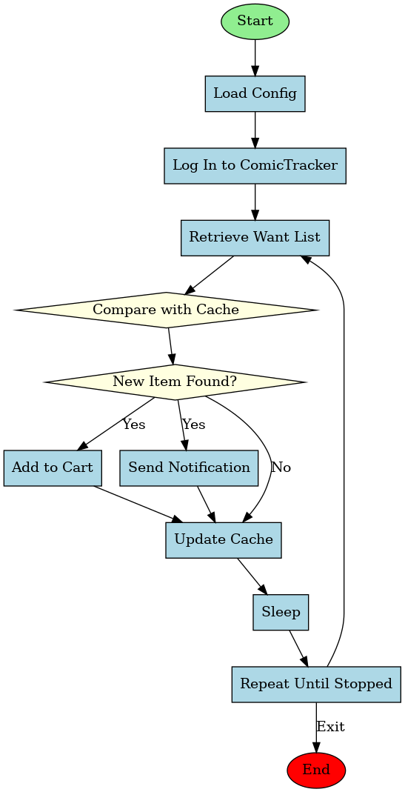

# Comic Availability Scanner

A Python script that monitors a comic book site for items on your want list and notifies you when they become available.

## How It Works

The script follows this workflow to monitor for new comic availability:



## Features

- Automatically scans a comic book website's want list for new items
- Filters out items based on configurable exclusion filters
- Can automatically add items to cart when they become available
- Sends email notifications when new items are found
- Caches found items to prevent duplicate notifications

## Requirements

- Python 2.7
- Required packages:
  - lxml
  - ConfigParser
  - urllib2
  - cookielib

## Setup

1. Copy `config.cfg.example` to `config.cfg`
2. Edit `config.cfg` with your personal settings:
   - SMTP settings for email notifications
   - Comic site login credentials
   - URL configurations for your comic site
   - Check interval and other preferences

## Usage

Simply run the script:

```
python comic_scanner.py
```

The script will:
1. Log in to the comic book website
2. Check your want list for available items
3. Add items to cart if configured to do so
4. Send notifications about found items
5. Sleep for the configured interval
6. Repeat until terminated

## Configuration Options

### SMTP Configuration

- `SMTP_FROM_ADDRESS`: Email address to send notifications from
- `SMTP_TO_ADDRESS`: Email address to send notifications to
- `SMTP_HOST`: SMTP server hostname
- `SMTP_PORT`: SMTP server port
- `SMTP_USERNAME`: SMTP server login username
- `SMTP_PASSWORD`: SMTP server login password

### General Configuration

- `COMIC_SITE_LOGIN_URL`: URL for logging into the comic site
- `COMIC_SITE_WANT_LIST_URL`: URL for accessing your want list
- `COMIC_SITE_ADD_TO_CART_URL`: URL for adding items to cart
- `COMIC_SITE_USER_NAME`: Your username on the comic site
- `COMIC_SITE_PASSWORD`: Your password on the comic site
- `CHECK_INTERVAL_SECONDS`: How often to check for new items (in seconds)
- `SEND_NOTIFICATIONS`: Whether to send email notifications (true/false)
- `AUTO_ADD_TO_CART`: Whether to automatically add items to cart (true/false)
- `ITEM_MESSAGE_EXCLUDE_FILTERS`: Comma-separated list of text to filter out items

## Note

This is an anonymized version of a comic book site monitoring script. You'll need to adapt the parameter names in the config file to match the specific site you're using. 